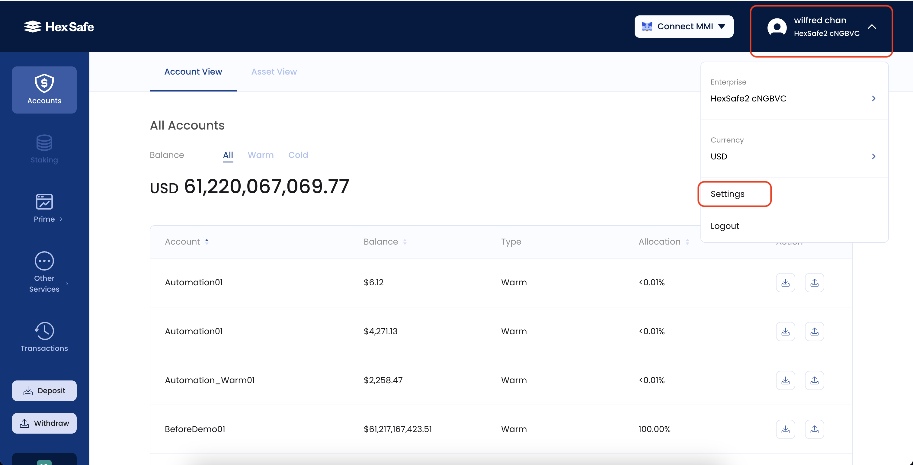
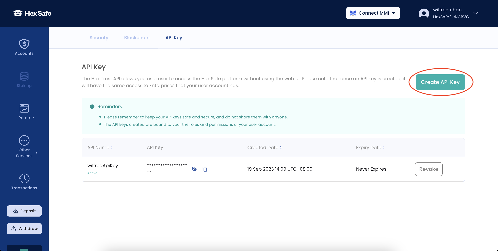
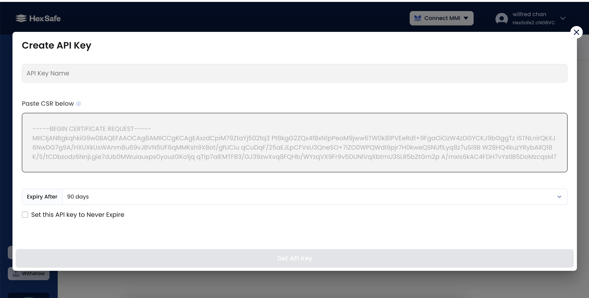

# Prerequisite
Need an account for `https://hexsafe.hextech.io` with permission to create API keys

(reference to Sign Up for hexsafe)

# 1.0 How to access hexsafe REST APIs
Two headers are required for accessing most of the APIs
- API key in the http header "x-api-key"
- Bearer Token in the "authorization" header


# 1.1 What are API Keys and how to authenticate
API key is the identity of a register user for using Hexsafe REST APIs


Every API Key is bound to a pair of RSA Public/Private Keys.
- Private key is stored at the client side. It is used for signing JWTs that will be used as the bearer token for authentication
- Public key is provided by the user when generating the API Key. It is also stored in hexsafe server side for verifying the bearer token


# 1.2 How to generate API Key
- Before generating API key, user needs to create a pair of RSA Public/Private Key, then use them to create a certificate signing request (.csr) file

## How to create RSA key pair with OpenSSL
```bash
# generate private key
openssl genrsa -out my_rsa.pem 4096
# generate public private key
openssl rsa -in my_rsa.pem -pubout -out my_rsa_pubkey.pem

# generate csr
openssl req -key ./my_rsa.pem -subj "/C=HK/O=Hextrust/CN=testing.hextrust.com/emailAddress=testingapiclient@hextrust.com" -new -out my_rsa.csr
```

## How to upload the .csr file and get the API key
- Login to `https://hexsafe.hextech.io`
- Click the drop down at the top right corner next to the user name
- Go to Settings

- Go to API Key and press "Create API Key"

- Name your API key
- Copy and paste the content from "my_rsa.csr" to the text box
- Set the expiry date and press "Get API Key"



# 1.3 How to generate Bearer Token
- The bearer token is a JWT with the following format:
```json
{
  	"exp": 1694673536,
  	"api-key": "hsk_89c6d8a1d313461db1a37dd0d1f88661",
  	"uri": "/v1/validate",
  	"nonce": 4242658338,
  	"digest": "wij3HROZrND_YdAzUHHuqJUYgUchg7EKg8bPzCk3LMXOq9c00UxCL2g82A6TcPxoo2w_eWDDJUf-dD18vvOKLg=="
}
```

| Key | Description |
| --- | ----------- |
| exp | Expiray time of the JWT, suggest to set it for 1 minute, just enough to call the API before expired |
| api-key | The api key generated above |
| uri | the path of the API |
| nonce | a random number provided by user to prevent replay attack, only necessary for POST request |
| digest  | a base64url string of concat(compact JSON body, nonce) SHA512 hash, to ensure the POST body cannot be tempered, only necessary for POST request |
