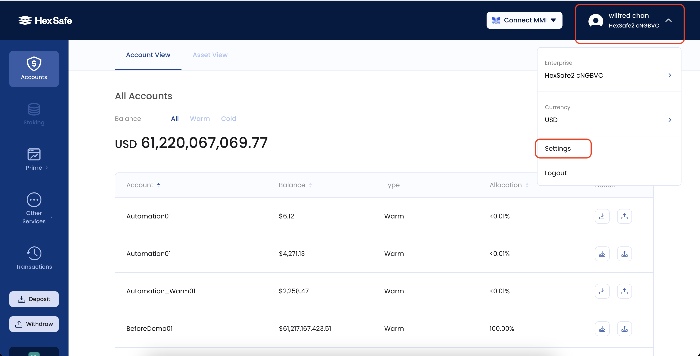
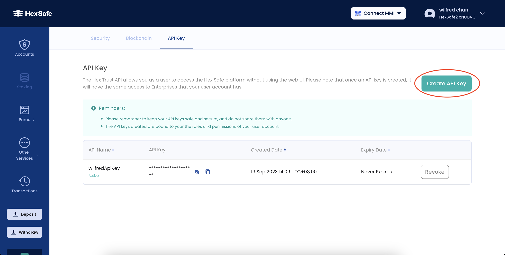
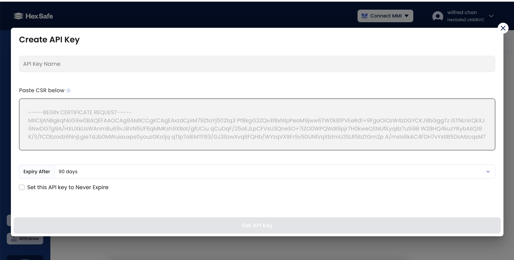

# Prerequisite

Before you begin, you need an account for `https://hexsafe.hextech.io` with permissions to create API keys. 
If you don't have an account, please sign up for Hexsafe.


# 1.0 How to access hexsafe REST APIs
Two headers are required for accessing most of the APIs
- An API key in the "x-api-key" HTTP header
- A Bearer Token in the "authorization" header


# 1.1 What are API Keys and how to authenticate
An API key is a unique identifier associated with a registered user that allows them to use Hexsafe REST APIs.


Every API Key is bound to a pair of RSA Public/Private Keys.
- The Private Key is stored on the client side. It is used to sign JWTs (JSON Web Tokens), which are then used as the bearer token for authentication.
- The Public Key is provided by the user when generating the API Key. It is stored on the Hexsafe server side and used to verify the bearer token.


# 1.2 How to generate API Key
- Before you can generate an API key, you need to create a pair of RSA Public/Private Keys. You then use these keys to create a Certificate Signing Request (CSR) file.

## Creating an RSA Key Pair with OpenSSL
```bash
# Generate the private key
openssl genrsa -out my_rsa.pem 4096

# Generate the public key
openssl rsa -in my_rsa.pem -pubout -out my_rsa_pubkey.pem

# Generate CSR
openssl req -key ./my_rsa.pem -subj "/C=HK/O=Hextrust/CN=testing.hextrust.com/emailAddress=testingapiclient@hextrust.com" -new -out my_rsa.csr
```

## Uploading the CSR File and Obtaining the API Key
1. Login to `https://hexsafe.hextech.io`
2. Click the dropdown at the top right corner next to your username.
3. Go to Settings



4. Go to API Key and press "Create API Key"
 


5. Name your API key
6. Copy and paste the content from "my_rsa.csr" to the text box
7. Set the expiry date and press "Get API Key"



# 1.3 Generating a Bearer TokenThe bearer token is a JWT with the following format

The bearer token is a JWT with the following format:
```json
{
  	"exp": 1694673536,
  	"api-key": "hsk_89c6d8a1d313461db1a37dd0d1f88661",
  	"uri": "/v1/validate",
  	"nonce": 4242658338,
  	"digest": "wij3HROZrND_YdAzUHHuqJUYgUchg7EKg8bPzCk3LMXOq9c00UxCL2g82A6TcPxoo2w_eWDDJUf-dD18vvOKLg=="
}
```


| Key | Description |
| --- | ----------- |
| exp | The expiry time of the JWT. It's recommended to set this to 1 minute, which should provide enough time to call the API before the token expires. |
| api-key | The API key obtained from the previous step. |
| uri | The path of the API. |
| nonce | A random number provided by user to prevent replay attacks. This is only necessary for POST requests. |
| digest | A Base64Url encoded string of the SHA512 hash of the concatenated compact JSON body and nonce. This ensures the POST body cannot be tampered with and is only necessary for POST requests. |

